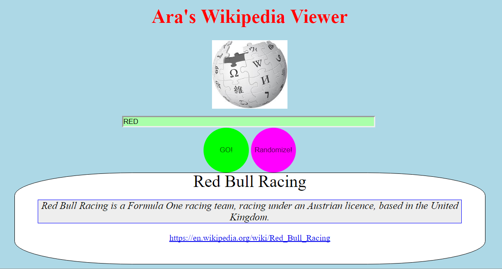

# Ara's Wikipedia Viewer

## This is Project 7 for CareerDevs

The goal of this exercise is to use the Wikipedia API to fetch relevant JSON data and display it in specific ways for the user to see and use.

#### Requirements:

User Story: I can search Wikipedia entries in a search box and see the resulting Wikipedia entries.

User Story: I can click a button to see a random Wikipedia entry.

Webpage Link:
